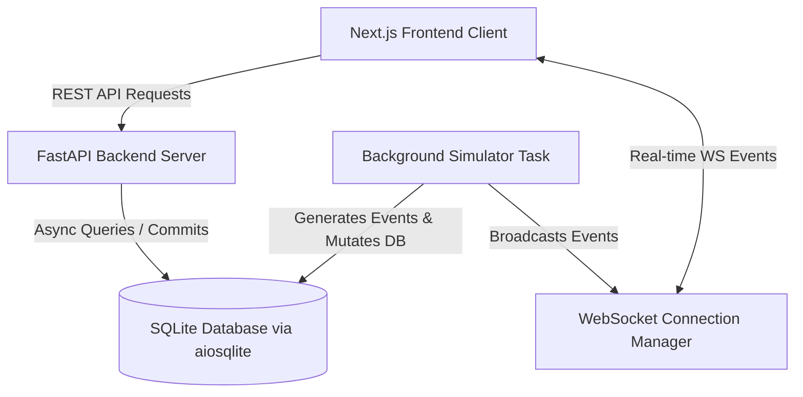
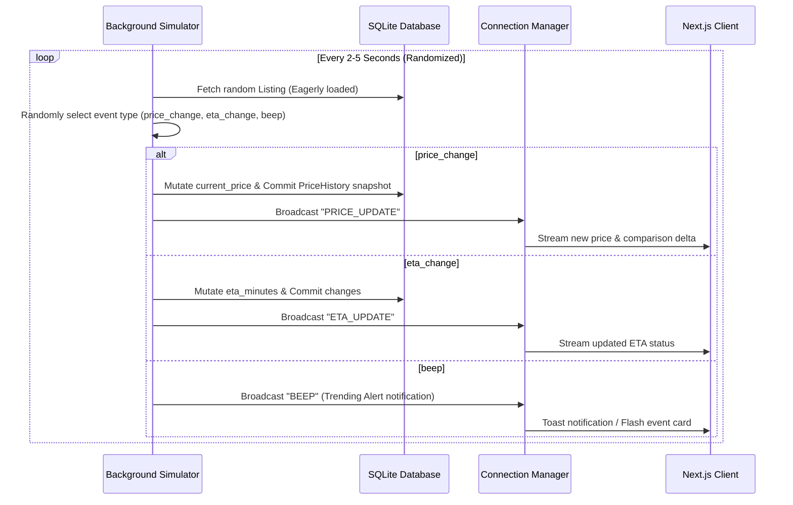

# PriceWatch — Real-time Commerce Intelligence Platform Architecture

PriceWatch is a high-performance commerce intelligence application designed to stream real-time price changes, compute delivery windows across multiple online platforms (E-commerce and Quick-commerce), and optimize order distribution using custom optimization algorithms.

---

## 1. System Overview

The platform is split into three main parts:
1. **Frontend (Next.js 15, React 19, TypeScript)**: A premium Bloomberg-style dashboard designed for live-updating tickers, visual charting, and quick basket optimization.
2. **Backend (FastAPI, Python)**: An asynchronous REST and WebSocket API hosting the business logic, stream manager, and simulator engines.
3. **Database (SQLite with Async SQLAlchemy)**: Relational schema storing platforms, product catalogs, listing details, and historical price logs.

---

## 2. Core Architecture Modules

### 2.1 Backend Application Setup (`backend/app/main.py`)
- **FastAPI Core Application**: Configured with CORS matching `http://localhost:3000`.
- **Async Lifespan Handler**: 
  - Starts the background `simulator_task()` inside an event loop on server startup (`asyncio.create_task()`).
  - Cleans up and cancels the running task gracefully during shutdown.
- **Global Error Handling**: Catches exceptions and responds with standardized JSON responses.

### 2.2 Database Engine & Models (`backend/app/core/database.py` & `models/product.py`)
- Uses **SQLAlchemy 2.0 Async Engine** (`create_async_engine`) connected to a local `pricewatch.db` via `sqlite+aiosqlite`.
- Implements async dependency injection for route handlers via `get_db()`.
- **Relational Tables**:
  - `Platform`: Stores marketplace names and logo locations (e.g. Amazon, Blinkit, Zepto).
  - `Product`: Base details of catalog items (name, description, category, trending status).
  - `Listing`: Connects products to specific platforms with live fields (`current_price`, `original_price`, `eta_minutes`, `in_stock`).
  - `PriceHistory`: Snapshots price & ETA changes over time, optimized for timeseries indexing and charting.

---

## 3. Real-time Streaming & Simulation

Real-time price intelligence is simulated using a background worker that broadcasts events to active clients over WebSockets.

### Connection Manager (`backend/app/api/endpoints/stream.py`)
- Tracks active WebSocket sockets in an internal list.
- Safely handles connection handshakes (`connect`), disconnections (`disconnect`), and failures.
- **Broadcast System**: Concurrent event dispatching. If any active client socket experiences errors, it is automatically pruned from the registry to prevent connection leaks.

---

## 4. API Endpoints Catalog

### 4.1 Product Catalog Routing (`/api/products`)
- **`GET /`**: Search and filter products by text query (`q`), Category (`category`), and Trending Status (`trending`). Includes eager database pre-loading to prevent N+1 queries.
- **`GET /{product_id}`**: Retrieves a specific product and its platform listings.
- **`GET /{product_id}/history`**: Aggregates historical price lists up to 90 days. Groups time-series snapshots by platform, ready for graphing libraries.

### 4.2 Smart Basket Optimizer Routing (`/api/products/basket/optimize`)
- **`POST /basket/optimize`**: Implements specialized order distribution algorithms using different user-selected strategies:
  - **`cheapest`**: Scans in-stock listings to route each item to the lowest-priced platform.
  - **`fastest`**: Routes items to minimize absolute delivery times (ETA).
  - **`balanced`**: Calculates optimal value scores combining price and delivery speeds.

---

## 5. Architectural Optimizations

1. **Avoid Lazy-Loading in Background Threads**: The simulator worker eagerly loads relations during queries to bypass greenlet execution issues.
2. **Standardized CORS Policies**: Restricts API calls to authorized frontend Origins to maintain CORS integrity.
3. **Database Eager Loading**: Relational routes leverage SQLAlchemy's `selectinload` strategy to minimize query counts.
